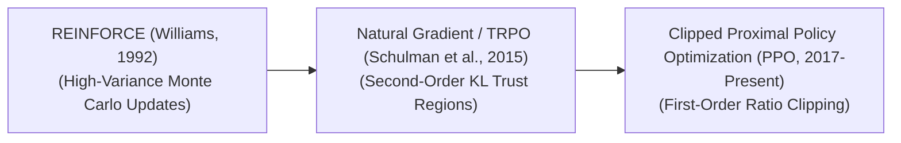

# Awesome-Policy-Gradient-Methods
## Policy Gradient Methods in AI: History, Progression, Variants, & Applications

Policy Gradient (PG) methods represent a foundational optimization paradigm in Reinforcement Learning (RL) that directly parameterizes and optimizes an agent's policy ($\pi_\theta(a|s)$) to maximize expected cumulative rewards. Unlike value-based methods (such as Q-Learning or DQN) which learn a value function and derive actions implicitly via greedy selection, policy gradient algorithms compute directional gradients directly over the policy parameters $\theta$ using gradient ascent. This architecture inherently handles high-dimensional, continuous action spaces, natively learns stochastic policies, and guarantees smooth convergence, serving as the default algorithmic framework driving contemporary robot kinematics, distributed multi-agent gaming simulators, and large-scale post-training reasoning model alignments.

---

## 1. The Macro Chronological Evolution

The algorithmic implementation of direct policy optimization has transitioned from basic analytical variance tracking to bounded statistical distance thresholds and clipped first-order inference approximations.

*   **The Baseline Monte Carlo Era (REINFORCE, Williams, 1992)**
    *   *Concept:* The core foundational breakthrough.基因 Established that a policy's expected return gradient could be estimated analytically without knowing the environment's true transition derivatives. It used full Monte Carlo episode trajectories to score action log-probabilities.
    *   *Limitation:* Suffered from catastrophic **high variance**. Because a single step update depended on an entire unconstrained sequence rollout, a single anomalous trajectory could cause policy gradients to fluctuate wildly, disrupting convergence.
*   **The Statistical Distance & Trust Region Era (TRPO, Schulman et al., 2015)**
    *   *Concept:* Stabilized step-size optimization via game-theoretic constraints. **Trust Region Policy Optimization (TRPO)** moved past raw weight updates to enforce a strict boundary on the *output probability distribution* itself using a second-order Kullback-Leibler (KL) Divergence constraint.
    *   *Limitation:* Computationally prohibitive at scale. TRPO required calculating and inverting a massive second-order Fisher Information Matrix and executing conjugate gradient loops, saturating hardware VRAM.
*   **The Clipped Bound Proximal Era (PPO, Schulman et al., 2017–Present)**
    *   *Concept:* The current modern state-of-the-art production baseline. **Proximal Policy Optimization (PPO)** refactored the complex mathematical trust-region constraint into a simple, first-order clipped objective function. It strictly clamps the policy probability ratio within a tight structural window (typically $[1-\epsilon, 1+\epsilon]$, where $\epsilon=0.2$).
    *   *Significance:* Preserved the absolute training stability and data efficiency of traditional trust regions while running at the lightning-fast execution speeds of standard first-order gradient descent.

---

## 2. Core Algorithmic & Advantage Variants

Policy Gradient frameworks are strictly categorized based on how the directional gradient updates are baseline-corrected to minimize optimization variance.

- ### A. REINFORCE (Vanilla Policy Gradient)
	*   **Mechanism:** Multiplies the raw log-probability gradient by the absolute unadjusted cumulative return ($G_t$) of the sequence rollout:
	    $$g = \mathbb{E} \left[ \nabla_\theta \log \pi_\theta(a_t|s_t) G_t \right]$$
	*   **Cons:** Exceptional structural simplicity, but suffers from extreme sample inefficiency and high variance.

- ### B. Advantage Actor-Critic (A2C / A3C)
	*   **Mechanism:** Introduces an explicit baseline by calculating the **Advantage Function**: $A(s,a) = Q(s,a) - V(s)$, practically estimated via the temporal difference (TD) error. The policy gradient is scaled by this delta:
	    $$g = \mathbb{E} \left[ \nabla_\theta \log \pi_\theta(a_t|s_t) A(s_t, a_t) \right]$$
	*   **Pros:** Focuses the gradient update strictly on whether an action performed better or worse than the *average expected outcome* for that state, drastically suppressing step variance.

- ### C. Deep Deterministic Policy Gradient (DDPG / TD3)
	*   **Mechanism:** Tailored explicitly for continuous action domains where the policy output is deterministic ($a = \mu(s)$). The policy network parameter updates follow the direct directional gradient of a continuous critic model's action-value output with respect to the action coordinates themselves.

- ### D. Clipped PPO Objective
	*   **Mechanism:** Optimizes policy parameters directly by taking the minimum of an unconstrained probability ratio update and a clipped alternative:
	    $$\mathcal{L}_{\text{CLIP}}(\theta) = \hat{\mathbb{E}}_t \left[ \min(r_t(\theta)\hat{A}_t, \text{clip}(r_t(\theta), 1-\epsilon, 1+\epsilon)\hat{A}_t) \right]$$
	*   **Pros:** Prevents the policy from taking overly destructive parameter steps that could trigger catastrophic capacity collapse during online distributed training sweeps.

---

## 3. Training Paradigms & Data Ingestion Modalities

Depending on how experience transitions are processed and recycled through distributed clusters, PG implementations follow distinct scheduling tracks.

*   **On-Policy Policy Gradients (Rigid Synchronization)**
    *   *Profile:* Experience states must be generated strictly by the active model policy parameters. Once a batch of experiences is consumed for a gradient ascent step, it is immediately discarded to prevent data contamination.
    *   *Infrastructure Impact:* Demands highly parallelized environment simulators (such as NVIDIA Isaac Gym running on hardware acceleration) to generate millions of steps on-the-fly.
*   **Off-Policy Actor-Critic Adaptations (Replay Buffer Scaling)**
    *   *Profile:* Ingests data from a massive, historical **Experience Replay Buffer**. The policy optimizes parameters by using Importance Sampling ratios to mathematically recalibrate older transitions collected by older model checkpoints.
    *   *Significance:* Maximizes sample efficiency, making it the primary choice when training on physical hardware (like humanoids) where gathering live data is dangerous or expensive.

---

## 4. Production Engineering Challenges & Hardware Solutions

Executing large-scale policy gradient runs across massive distributed GPU clusters introduces unique optimization bottlenecks.

*   **The Policy-Critic Co-Adaptation Desynchronization**
    *   *The Problem:* In Actor-Critic setups, the policy network relies completely on the Value Network (Critic) to calculate its advantage scalars. If the Critic is poorly calibrated or experiences a gradient explosion early on, it emits corrupt advantage signals, causing the Actor's policy to diverge into permanent underfitting or destructive reward hacking.
    *   *Mitigation:* Implementing **Target Networks ($\theta^-$)** that update via slow exponential moving averages (Polyak averaging) to anchor the advantage evaluations stably, paired with separate architectural networks for the Actor and Critic to prevent feature cross-contamination.
*   **The Synchronous Mini-Batch Communication Stalls**
    *   *The Problem:* Gathering on-policy data over thousands of independent simulation workers requires continuous, synchronous CPU-to-GPU data transfers, creating massive I/O bottlenecks that keep tensor cores running under capacity.
    *   *Mitigation:* Running model environments natively inside **Fused GPU Simulation Kernels**, allowing the policy tokens, advantage values, and environment transitions to reside entirely within fast system memory arrays, eliminating PCIe transit lag.

---

## 5. Frontier Real-World AI Infrastructure Applications

*   **Post-Training Reinforcement Learning Alignment for Reasoning Models**
    *   *Application:* Serves as the mathematical core optimizing elite reasoning architectures (such as OpenAI's o-series and DeepSeek-R1). The policy gradient engine takes the raw model tokens as action states, using **Clipped PPO objectives** to tune the model over programmatic, verifiable reward environments (like code sandboxes). This rewards self-correction traces while punishing logical fallacies cleanly.
*   **Continuous Kinetic Torque Control for Humanoid Robotics**
    *   *Application:* Coordinates high-frequency motor actuation loops for advanced bipedal and quadrupedal robots. Deterministic and stochastic policy gradient systems (such as SAC or TD3 modules) run locally on edge TPU architectures, interpreting streaming IMU and force feedback signals to execute posture corrections in real time.
*   **High-Frequency Multi-Agent Autonomous Asset Trading Matrices**
    *   *Application:* Directs global quantitative investment allocations across volatile, structural financial landscapes. Policy gradient modules execute continuous portfolio weight updates, tracking shifting transaction cost trends while maximizing long-term returns under strict trust-region risk limits.

---

## References
1. Williams, R. J. (1992). Simple statistical gradient-following algorithms for connectionist reinforcement learning. *Machine Learning*, 8(3-4), 229-256.
2. Sutton, R. S., et al. (1999). Policy gradient methods for reinforcement learning with function approximation. *Advances in Neural Information Processing Systems (NeurIPS)*, 12.
3. Schulman, J., et al. (2015). Trust region policy optimization. *International Conference on Machine Learning (ICML)*, 1889-1897.
4. Mnih, V., et al. (2016). Asynchronous methods for deep reinforcement learning. *International Conference on Machine Learning (ICML)*, 1928-1937.
5. Schulman, J., et al. (2017). Proximal policy optimization algorithms. *arXiv preprint arXiv:1707.06347*.
6. DeepSeek-AI. (2025). DeepSeek-R1: Incentivizing reasoning capability in foundational models via scale-invariant on-policy reinforcement learning loops. *GitHub Repository Technical Report*.

---

To advance this documentation repository, infrastructure workspace, or post-training deployment pipeline, consider exploring these adjacent development pathways:
* Build a **Python code snippet using PyTorch** illustrating how to implement a basic REINFORCE policy gradient loss function that calculates categorical action log-probabilities manually.
* Generate a **comprehensive Markdown table** explicitly comparing REINFORCE, A2C (Actor-Critic), TRPO, and PPO across computational step complexity, execution memory tracking profiles, target action types (discrete vs. continuous), sample efficiency scales, and convergence guarantees.
* Establish an **automated performance profiling suite using Triton** to track the exact computational throughput and memory bus latency metrics achieved when compiling a fused PPO token-generation and policy ratio clip calculation directly into high-speed GPU SRAM registers.

***

**Proactive Repository Follow-Ups:**

To assist with your documentation repository setup, let me know how you would like to proceed by choosing one of the options below:
