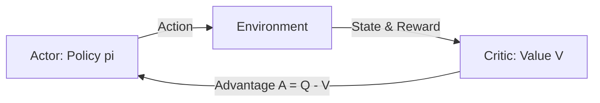

# Advantage Actor-Critic (A2C / A3C)

## Overview
**Actor-Critic** methods reduce variance by introducing an estimator for expected returns (Critic) to baseline the Actor's policy updates.

## Actor-Critic Interaction

[← Back to README](../README.md)