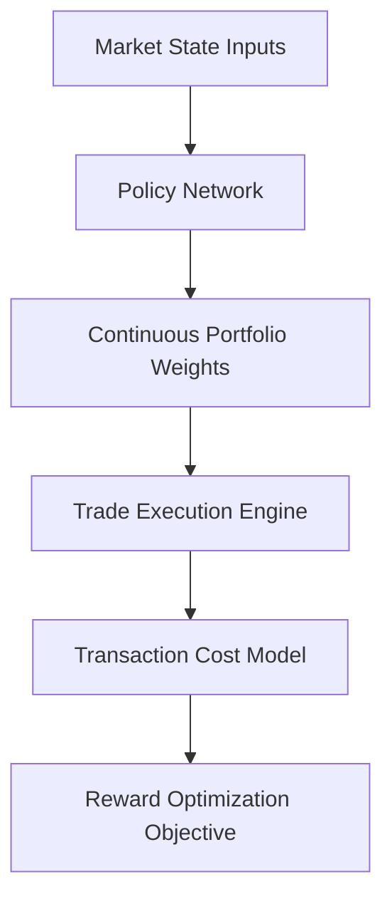

# High-Frequency Multi-Agent Autonomous Asset Trading Matrices

## Overview
Executes quantitative investment allocations across financial landscapes using policy gradients.

## Trading Loop

[← Back to README](../README.md)