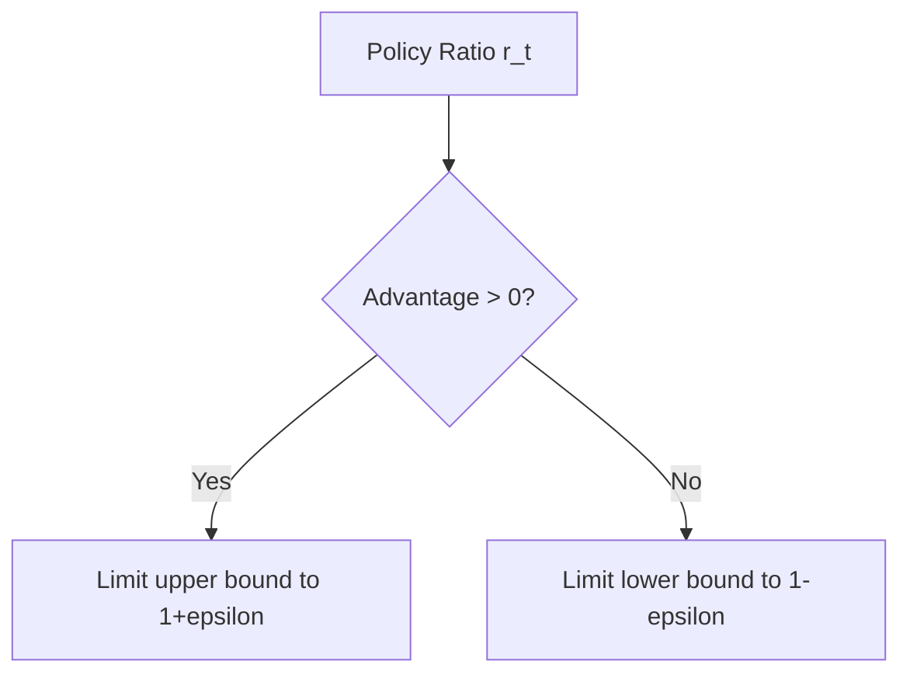

# Clipped PPO Objective

## Overview
The clipped objective in PPO prevents the current policy from diverging too far from the old policy.

## Mathematical Objective
$$\mathcal{L}_{\text{CLIP}}(\theta) = \hat{\mathbb{E}}_t \left[ \min(r_t(\theta)\hat{A}_t, \text{clip}(r_t(\theta), 1-\epsilon, 1+\epsilon)\hat{A}_t) \right]$$

## Clipping Boundaries

[← Back to README](../README.md)