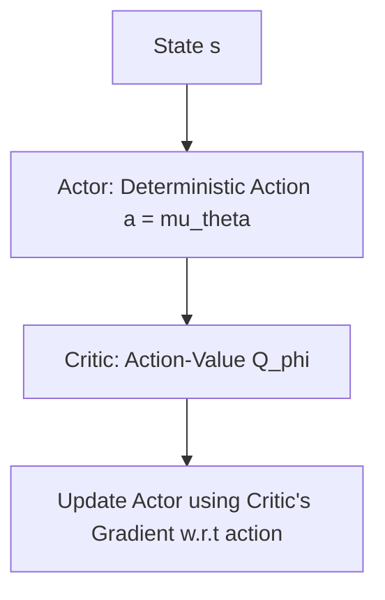

# Deep Deterministic Policy Gradient (DDPG / TD3)

## Overview
**DDPG** and **TD3** are actor-critic variants designed for continuous action spaces, utilizing deterministic policies.

## Deterministic Optimization Loop

[← Back to README](../README.md)