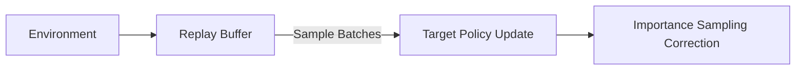

# Off-Policy Actor-Critic Adaptations

## Overview
Off-policy adaptations use experience replay buffers to recycle transitions gathered by historical policies.

## Replay Architecture

[← Back to README](../README.md)