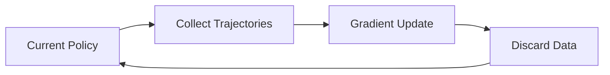

# On-Policy Policy Gradients

## Overview
On-policy methods strictly optimize parameters using samples generated directly by the current policy.

## Synchronization Loop

[← Back to README](../README.md)