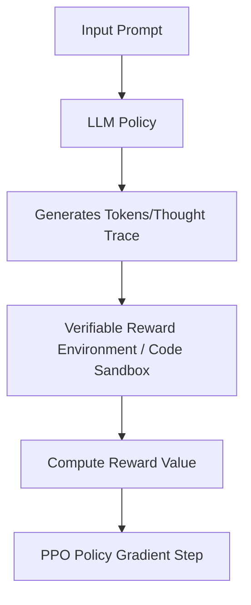

# Post-Training RL Alignment for Reasoning Models

## Overview
Applies policy gradient algorithms (like Clipped PPO) to align Large Language Models for structured reasoning.

## Alignment Pipeline

[← Back to README](../README.md)