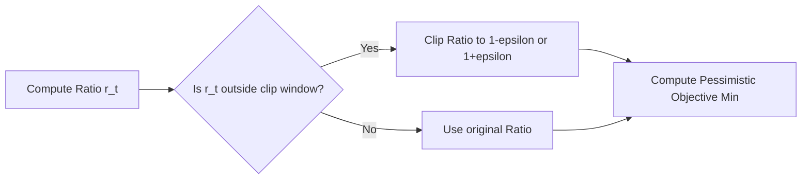

# The Clipped Bound Proximal Era (PPO)

## Overview
**Proximal Policy Optimization (PPO)** (Schulman et al., 2017) simplified the complex trust region constraint of TRPO into a first-order optimization objective with ratio clipping.

## Clipped Objective Flow

## Key Characteristics
- **First-Order:** Uses standard gradient descent.
- **Ratio Clipping:** Clamps the probability ratio to prevent destructive updates.
- **State-of-the-Art:** default choice for general RL benchmarks.

[← Back to README](../README.md)