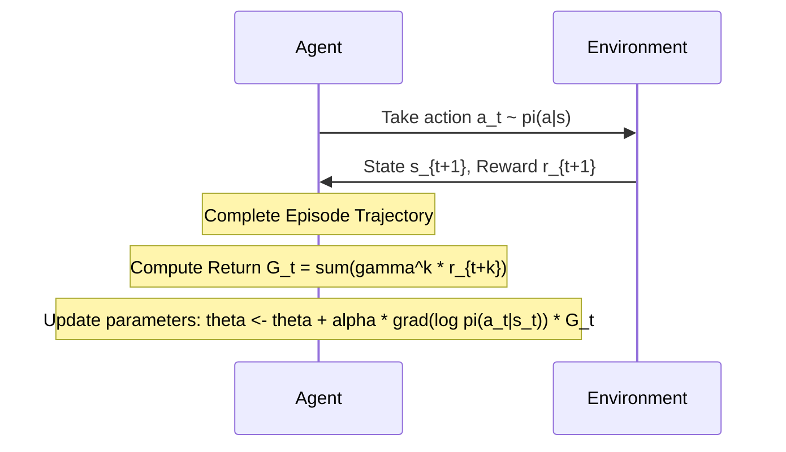

# The Baseline Monte Carlo Era (REINFORCE)

## Overview
The **REINFORCE** algorithm (Williams, 1992) is the foundational Monte Carlo policy gradient method. It established that we can estimate the gradient of expected returns directly from trajectory rollouts without knowing the transition dynamics of the environment.

## Architecture & Flow

## Key Characteristics
- **On-Policy:** Requires samples generated from the current policy parameters.
- **High Variance:** Updates are based on full Monte Carlo returns ($G_t$), making them sensitive to noisy trajectories.
- **Unbiased:** The gradient estimate is mathematically unbiased.

[← Back to README](../README.md)
