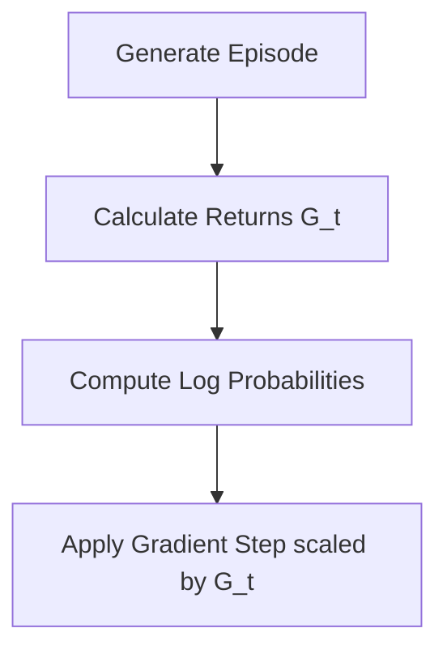

# REINFORCE (Vanilla Policy Gradient)

## Overview
**REINFORCE** scales policy gradient directions by the raw cumulative return ($G_t$). 

## Optimization Formula
$$g = \mathbb{E} \left[ \nabla_\theta \log \pi_\theta(a_t|s_t) G_t \right]$$

## Process Flow

[← Back to README](../README.md)