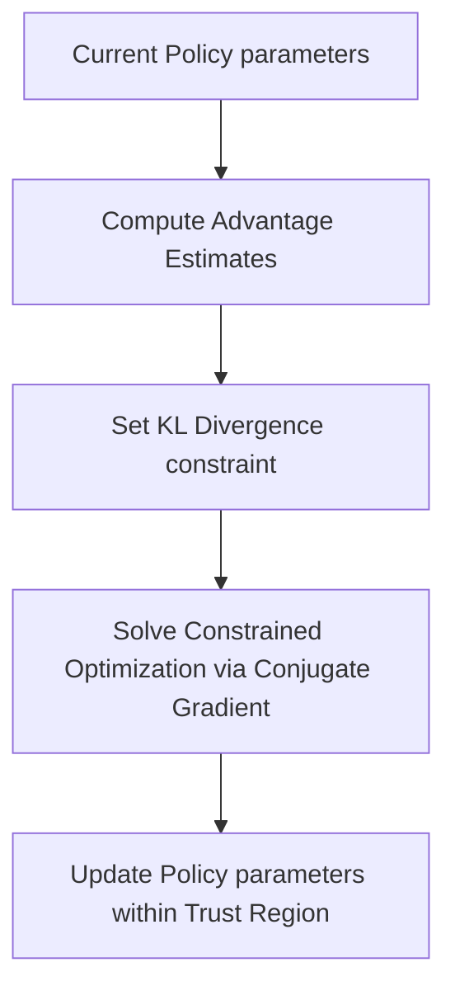

# The Statistical Distance & Trust Region Era (TRPO)

## Overview
**Trust Region Policy Optimization (TRPO)** (Schulman et al., 2015) introduced statistical distance bounds to stabilize policy updates. Instead of changing policy weights blindly, TRPO constrains the update using Kullback-Leibler (KL) divergence on the policy's action distribution output.

## Optimization Flow

## Key Characteristics
- **Second-Order Optimization:** Uses Fisher Information Matrix for constraint.
- **Monotonic Improvement:** Guarantees policy improvement mathematically.
- **High Compute Overhead:** Requires expensive matrix inversions.

[← Back to README](../README.md)